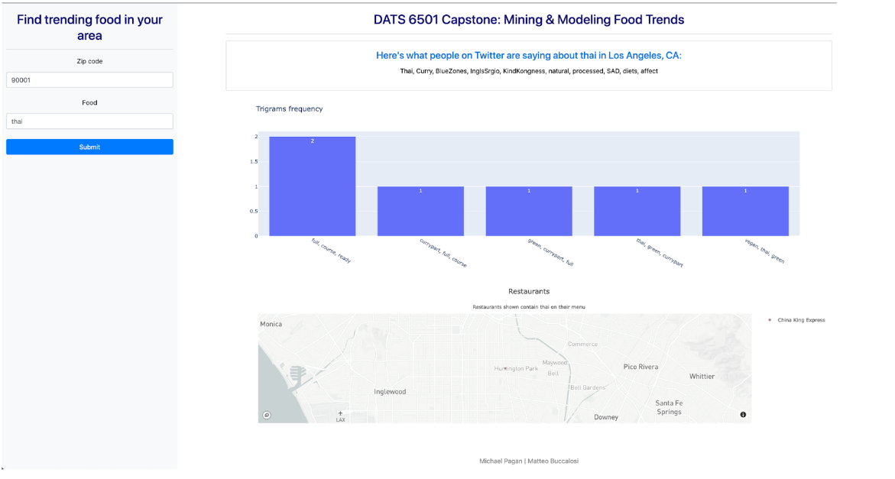

# DATS 6501_10 Capstone Project

## Problem Statement
The restaurant industry struggles with gaining a competitive advantage as food trends readily change in a dynamic market influenced by social media. Being able to innovate food offerings and understand trends means success in this fluctuating market. 

Using current data from social media to understand food popularity by dish and region, industry leaders can keep up with these trends when considering new menu items or updates, and illustrate to consumers where these trends are available in their area. 

## Scope
Our project focused on four steps:
- Data Collection
  - Gathering data from Twitter via Twitter API using the `Tweepy` package 
  - Capturing zipcode-level restaurant information using [Documenu’s API](https://rapidapi.com/restaurantmenus/api/documenu/details)
- NLP:
  - Text preprocessing, token and n-gram frequency
  - LDA clustering to explore the dataset
- Machine learning:
  - Vectorizing free text using `word2vec` and `S-BERT` so users can retrieve relevant text from tweets by cosine similarity from their searches. 
  - Using the TF-IDF algorithm to identify trending chatter among the retrieved data.
- Dashboard:
  - The results are presented in a Dash-based UI for users to find trendings foods in their area.

## Results
The results derived from the NLP analysis and modeling were presented on a UI built on Dash. Here, users are presented with two input fields on the left-hand side where they can enter a food item and a zip code to be presented with keywords often associated with that item, the frequency of the bigrams associated with it, and a map of restaurants that have that item on their menu.

Behind the scenes, this dashboard first filters the Twitter data by the provided zip code and the tweets from the resulting rows and serves as the input for the NLP analyses and modeling. Using TF-IDF, which identifies the importance of single terms across a corpus, we communicated the keywords often associated within those tweets found by their search. The tweet text from the filtered dataset is then injected into the S-BERT model to calculate the embeddings for the sentences in each tweet. The filtered tweets are then used to deduce the common trigrams associated with the food input. Finally, the zip code is used to query Documenu’s GET Restaurants By Zip Code API and return the location of restaurants in the provided zipcode that have the input food item on their menu.

 

## Limitations
The most pertinent augmentation to this capstone project would be to increase the amount of data captured: more data leads to better NLP analyses and modeling. Our data were limited by the redundancy in how the Twitter API grabs past tweets and the availability of the tweets that meet our query critera, and the latter likely has an effect on the former - a more robust search could reduce the redundancy in the scrape. Moreover, a well-defined methodology for capturing both “trending” and “relevant” data would be a significant improvement to the methods employed in this capstone project. Finally, we would be able to show better and more numerous restaurant results if Documenu’s API returned the number of restaurants provided to their API should the aforementioned parser issue not exist.
